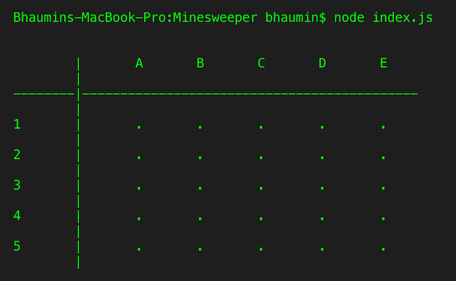
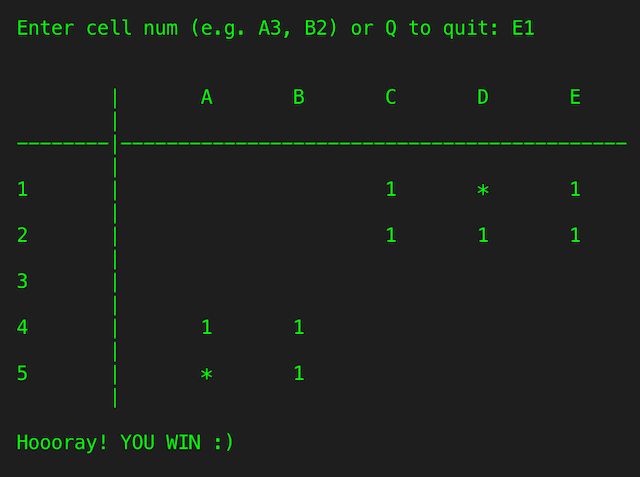

# Minesweeper Game
Simple Minesweeper game implementation in the console

 
 

More info: [Minesweeper Video Game](https://en.wikipedia.org/wiki/Minesweeper_(video_game))

Step ~~carefully~~ logically! :)
